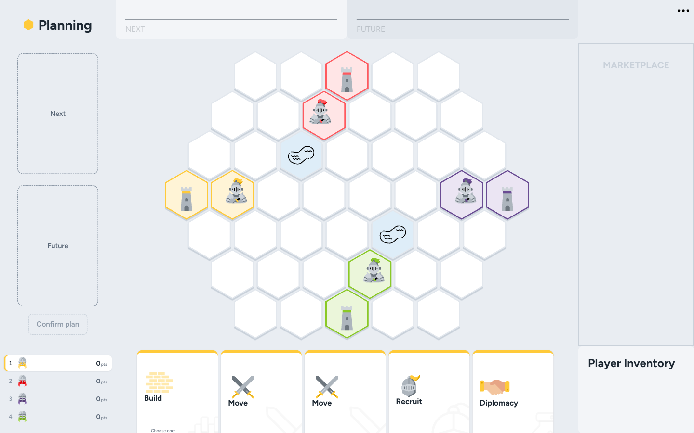

# Storming!

A browser version of _Storming!_, an original strategy board game for 3–4 players by Alfonso Ricardo Felipe López and Pablo Salinas. Plan your actions in secret, then build, recruit and march across a hex map: first to seven victory points, or to take a rival's last settlement, wins.

**[Play it](https://storming-coral.vercel.app)** · [Rules](rule-book/README.md) · [Changelog](CHANGELOG.md)



## Quick start

Node 24 (see `.nvmrc`):

```sh
nvm use
npm install
npm run dev
```

## License

[GPL-3.0](LICENSE)
